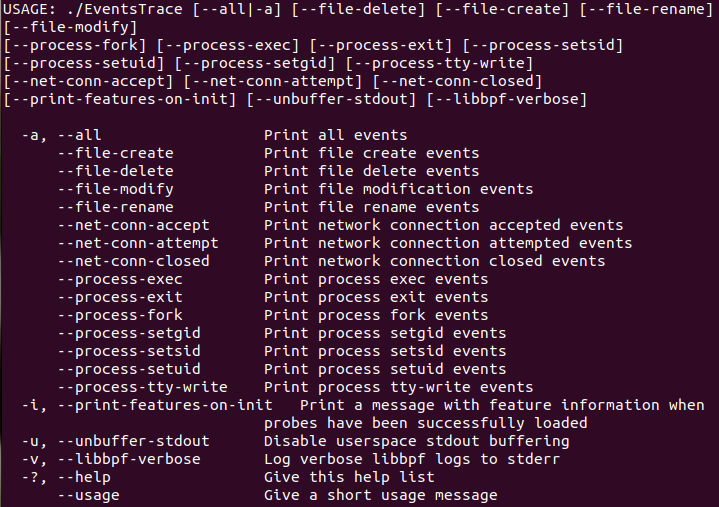
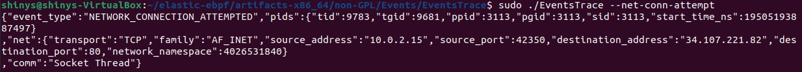
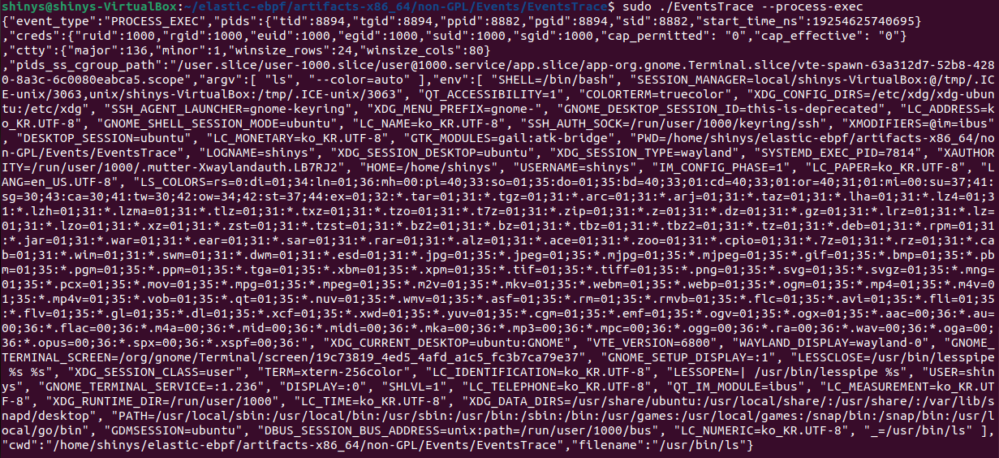
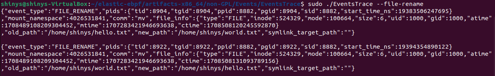

# elastic-eBPF

elastic/ebpf 에는 File, Process, Network 관련해 추적하는 eBPF 프로그램들이 있다.

eBPF 프로그램과 사용자 공간 프로그램 모두 C로 작성되어 있다.

<br></br>

## Run



<br></br>

몇 가지 출력값을 살펴보자.

```
$ sudo ./EventsTrace --net-conn-attempt
```


<br></br>

```
$ sudo ./EventsTrace --process-exec
```


<br></br>

```
$ sudo ./EventsTrace --file-rename
```

