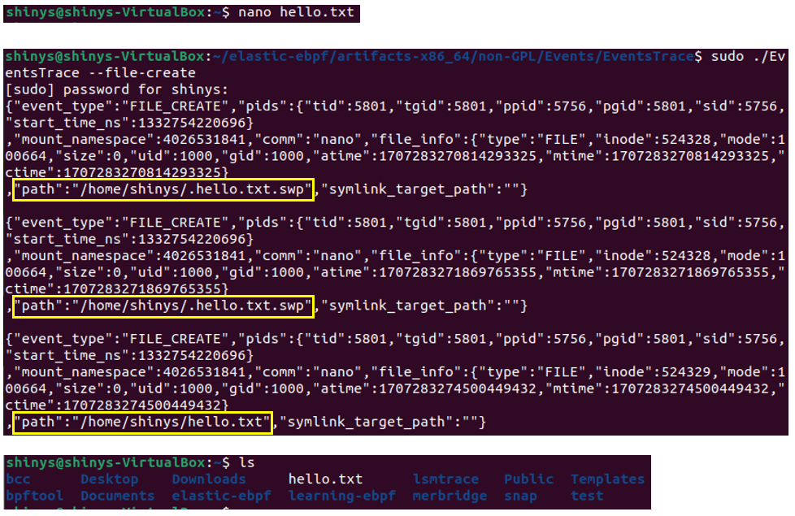
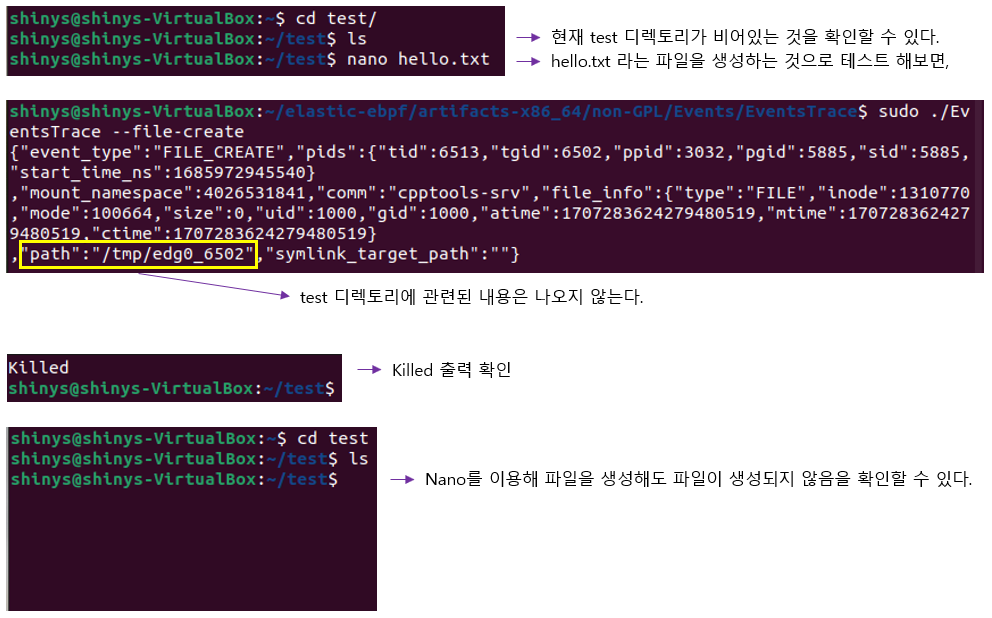

elastic/ebpf eBPF 프로그램에서 SigKill 호출 테스트를 위해 코드를 수정한 것이다.

특정 디렉토리 내에서 파일을 생성했을 때 killed 라는 출력 화면이 나오고, 파일 생성이 되지 않게끔 코드를 작성하였다.

## 개발 과정

lsmtrace eBPF 프로그램을 실행시킨 후, 
nano를 통해 특정 디렉토리 내에서 hello.txt 라는 파일을 생성했을 때 위와 같은 출력을 확인할 수 있고, hello.txt 파일도 잘 생성된 것을 확인할 수 있다.

directory path를 비교하여 /home/shinys 디렉토리에서 파일이 생성되는 것을 막을 수 있게 했다.
(Probe.bpf.c 코드 내 do_filp_open__exit 함수 참고)

## 테스트

