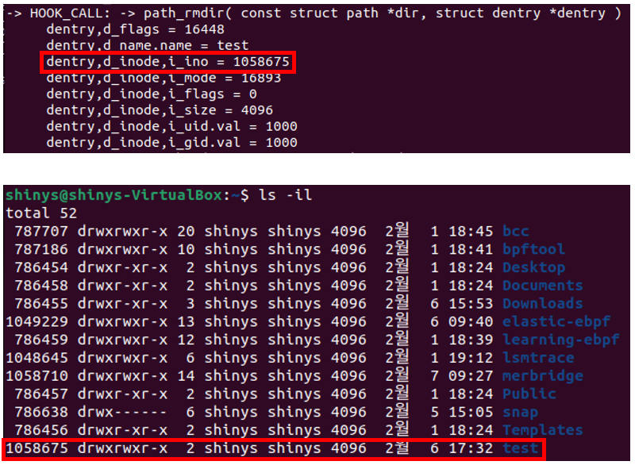
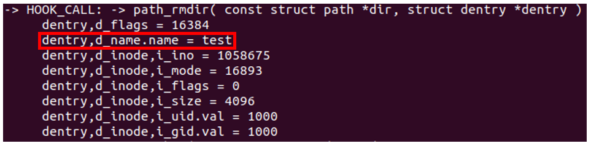
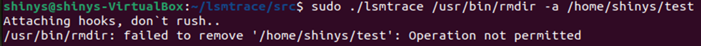

# 개요

lumontec/lsmtrace eBPF 프로그램에서 EPERM return test를 하기 위해 원래 코드에서 수정한 코드이다.

특정 디렉토리를 rmdir(remove directory) 명령으로 지우려 할 때, permission denied가 뜰 수 있게 lsmtrace.bpf.c 코드를 수정했다.
> 특정 디렉토리를 지정해줄 때는, inode값을 이용하는 방법 하나와 directory 이름을 이용하는 방법 하나로 두가지 방법을 이용했다.

<br></br>

# 개발 과정

첫 번째로, inode값을 이용해 return EPERM을 하는 과정이다.



사진에서 윗 부분은 lsmtrace를 실행했을 때 해당 디렉토리에 관련한 정보이다.

아랫 부분은
` $ ls -il `
을 이용해 해당 디렉토리의 inode값을 확인한 것이다.


두 화면에서 해당 디렉토리의 inode값을 특정할 수 있다. 이 inode값을 이용하여 코드에 추가해주었다.


두 번째로, path를 이용해 return EPERM을 하는 과정이다.



사진은 lsmtrace를 실행했을 때 해당 디렉토리에 관련한 정보이다. 사진을 참고하면, 해당 디렉토리의 path는 test임을 알 수 있다.


해당 디렉토리의 path를 특정한 후, 현재의 path와 비교하여 현재 path가 test 라면 return EPERM을 하도록 코드에 추가해주었다.

<br></br>

# 테스트

/home/shinys/test 디렉토리를 지우는 것으로 테스트를 진행했다.
```
$ rm -rf test
```
위 명령 실행 시, (lsmtrace의 원래 코드를 이용하려면 사진에서와 같이 입력해야 한다.)




이렇게 출력되는 것을 확인할 수 있고, permission denied가 잘 되는 것도 확인할 수 있었다.
