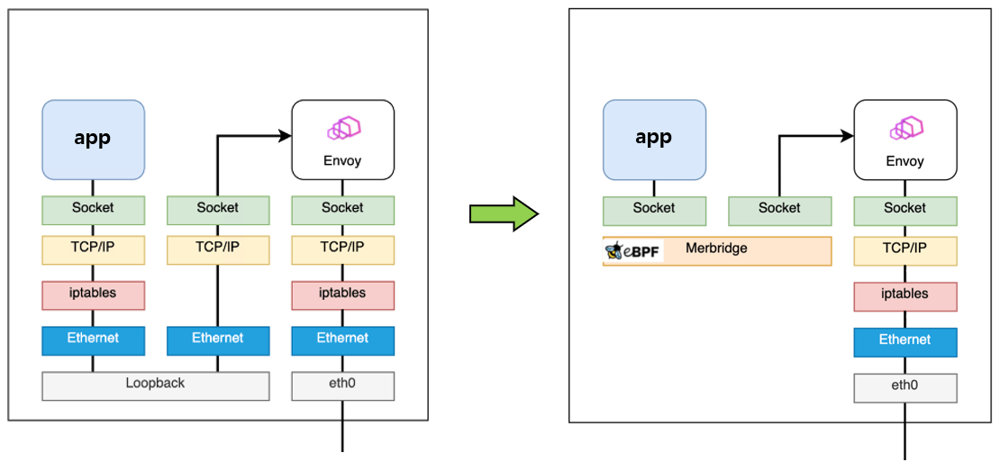
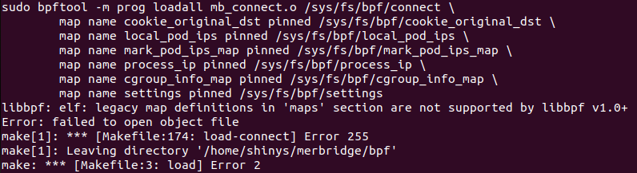

# merbridge

merbridge는 eBPF 프로그램을 통해 네트워킹 내 연결을 리다이렉션하여 envoy로의 연결로 바뀌도록 도와주고, iptable에서 했던 중복되는 작업들을 최소화하는 등의 기능을 한다.



eBPF 프로그램은 C로, 사용자 공간 프로그램은 go로 작성되어있다.

현재 사용중이던 Ubuntu 22.04로 merbridge build를 진행하니 아래와 같은 에러가 발생한다.



libbpf version이 맞지 않는 것으로 추정된다.

merbridge github에서는 Kubernetes를 이용한 환경으로 실행하였지만, Local 환경에서 실행하고자 Ubuntu 20.04에서 진행하였다.

<br></br>

# build

eBPF 프로그램 맵 생성 및 프로그램 load : 
```
$ make load
```

eBPF 프로그램 attach : 
```
$ make attach
```

eBPF 프로그램 detach :
```
$ make clean
```


