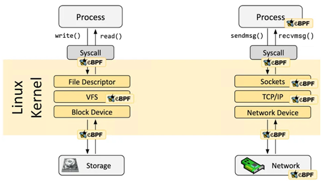
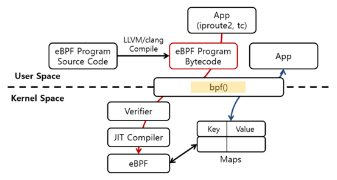
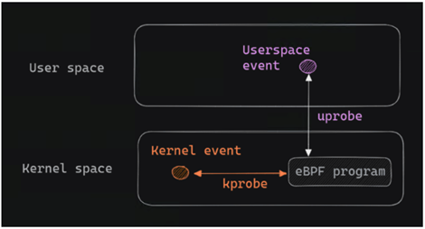
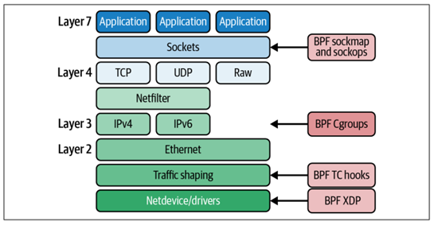

# eBPF란 ?

eBPF는 Extended Berkeley Packet Filters로, 패킷 필터인 BPF 프로그램이 확장된 것이다. BPF는 Unix계열 OS의 Kernel Level에서 Bytecode에 따라 동작하는 경량화된 VM으로, eBPF를 사용하면 프로그램이 커널 수준에서 발생하는 모든 것을 관찰하고 이벤트를 고속으로 처리할 수 있으므로 보안에 적절하게 사용된다.


기존 BPF와의 차이점은 eBPF 맵을 이용해 사용자 공간 app과 BPF 프로그램이 데이터를 공유할 수 있고, 더 많은 종류의 bpf helper function과 bpf() 시스템 호출을 활용하여 프로그램을 구성할 수 있으며, ebpf 검증기(verifier)가 추가되어 프로그램이 더 안전하게 실행될 수 있도록 보장한다.


  *[그림 1]*

[그림 1]과 같이 eBPF 프로그램은 filesystem과 network에 적용되어 악성 코드의 실행을 막는 등의 보안 측면은 물론이고 분석, monitoring, 추적, redirection, debugging 등에서도 다양하게 활용될 수 있다.


 *[그림 2]*

[그림 2]를 참고해보자. eBPF 프로그램은 C 또는 Rust를 이용해 소스 코드를 작성하게 되고(최근에는 go로도 작성되는 것 같다), LLVM 이나 Clang을 이용해 bytecode로 compile된다.

eBPF bytecode는 Kernel Level에서 동작하므로 system 전체에 영향을 줄 수 있는 위험한 상황을 방지하기 위해 Verifier로 이상이 없는지 검사를 진행한다. 그 후, JIT Compiler를 통해 native code로 변환되어 Kernel에서 동작한다.


eBPF 프로그램은 이벤트가 발생되었을 때, 그 이벤트 처리를 위해 연결된다.
> 이벤트 타입에는 Kprobe, tracepoint, 네트워크, socket, LSM 등이 있다.

<br></br>
또한 BTF는 데이터 구조, 코드의 메모리 배치 및 디버깅 정보를 설명하는데, bpftool btf dump id <id> 명령으로 확인할 수 있다.

컴파일 하는 과정에서 -g 플래그를 통해 생성되고, BTF가 있으면 eBPF 맵 생성 및 프로그램 load/attach를 위한 skel 코드 생성이 가능하다.


## 구조 및 기능

 *[그림 3]*

앞서 상술한 바와 같이 eBPF 프로그램의 attachment에는 kprobes, tracepoints, raw tracepoint, fentry/fexit probes 등이 있다.

예를 들면, execve() system call 진입 지점에 부착된 kprobe, do_execve() kernel 함수에 부착된 Kprobe, execve() system call 진입 지점에 위치한 tracepoint 등에 eBPF 프로그램이 연결 된다.

여기서 Kprobe는 Kernel probe라는 기능으로, 커널 코드의 명령에 트랩을 설정하는 것이다.

debugging이나 성능 측정 목적으로 함수를 작성하여 Kprobes에 연결할 수 있는데([그림 3] 참고), 2015년부터 eBPF 프로그램을 Kprobes에 부착할 수 있는 기능이 추가되었다.

Kprobe는 일반적으로 함수 진입 지점에 사용하고, Kretprobes는 함수 종료 지점에 사용하며, 특정 오프셋이 있는 명령에도 사용할 수 있다. Kprobe보다 조금 더 커널 버전 간에 안정적인 tracepoint도 있는데, 이는 커널 코드 내에서 표시된 특정 위치를 나타낸다.

Fentry는 Kprobe와 같이 함수 진입 지점에 사용되고, Fexit은 Kretprobe와 같이 함수 종료 지점에 사용되지만 Fexit은 Kreprobe와 달리 함수의 입력 매개변수에 엑세스할 수 있어 함수의 끝에서 이벤트를 생성하려는 경우 유용하게 사용할 수 있다.

eBPF 프로그램은 Linux Security Module(LSM) API에도 연결된다. LSM은 원래 커널 모듈이 보안 정책을 시행하는 데 사용하도록 고안된 커널 내의 안정된 인터페이스인데, 이를 이용해 여러 면에서 추적 프로그램처럼 처리한다.


#### 네트워킹에서의 eBPF
eBPF 프로그램에서의 반환 코드를 사용하여 커널에게 네트워크 패킷을 처리할 방법(평소처럼 처리, 삭제, redirection 등)을 알려준다. 또, eBPF프로그램이 네트워크 패킷, 소켓 구성 매개변수 등을 수정할 수 있도록 한다.


 *[그림 4]*

[그림 4]를 참고해보면, eBPF 프로그램이 Kprobes에 부착할 수 있는 기능이 추가되며 동시에 커널 네트워킹 스택 내에 훅이 추가되어 eBPF 프로그램이 네트워킹 기능의 다양한 측면도 처리할 수 있게 되었다.

XDP는 리눅스 커널에서 high-performance programmable packet processing을 가능케 하는 BPF 프레임워크를 제공한다. 이는 네트워크 드라이버가 패킷을 수신하는 순간(소프트웨어에서 가장 빠른 시점), BPF 프로그램을 실행한다.


# Build

### libbpf [](https://github.com/libbpf/libbpf)

eBPF프로그램을 작성하고 C 기반의 예제들을 build하려면 라이브러리인 libbpf를 빌드하고 헤더 파일을 설치해야 한다.

상세정보는 위 버튼 클릭 후 확인할 수 있다.


### bpftool [](https://https://github.com/libbpf/bpftool)

libbpf와 마찬가지로 eBPF프로그램을 작성할 때 필요한 tool이다.

상세정보는 위 버튼 클릭 후 확인할 수 있다.


### etc (Ubuntu 기준)
```bash
$ sudo apt-get update
$ sudo apt-get install -y apt-transport-https ca-certificates curl clang llvm jq
$ sudo apt-get install -y libelf-dev libcap-dev libbfd-dev binutils-dev build-essential make 
$ sudo apt-get install -y linux-tools-common linux-tools-$(uname -r) 
$ sudo apt-get install -y bpfcc-tools
$ sudo apt-get install -y python3-pip
```


##### eBPF의 trace 출력을 확인하는 방법은 아래와 같다.
- cat /sys/kernel/debug/tracing/trace_pipe
- bpftool prog tracelog (bpftool은 sudo를 사용한다.)


# 개발 & 테스트 관련 유의 사항

- 사용자 공간과 커널 공간 사이에서의 테이터 공유는 map을 이용해야 한다.

- bpftool feature 명령으로 커널 버전별로 사용 가능한 각 프로그램 유형에 대한 helper function 목록을 확인할 수 있다.
    > (BPF 서브 시스템이 계속 개발중이므로 불완전할 수 있다. 따라서 각 project별로 libbpf와 bpftool 등의 버전을 확인해야 한다.)


- 검증기 오류가 생각보다 많이 발생하므로, eBPF 프로그램의 특성을 잘 파악하고 learning-eBPF chapter6를 참고하는 것이 도움이 된다.
    > Filesystem Monitor를 개발할 때 char 타입 배열 target directory 설정 부분을 전역 변수로 두어야 검증기 오류가 나지 않는 것을 확인할 수 있었다. 이에 대한 구체적인 이유로는, 유저 공간과 커널 시스템의 데이터 공유는 맵을 통해 해야한다는 eBPF 특성과 관련하여 전역 변수로 설정하여야 맵으로 인식하기 때문이다. 여기서 전역 변수가 단일 원소 배열 유형의 특수한 맵임을 알 수 있다.

- eBPF 프로그램은 기본적으로 스택의 크기가 512바이트로 제한되어 있다.
> 맵을 힙처럼 사용하라는 가이드가 있다.
>
> https://github.com/iovisor/bpftrace/blob/master/docs/internals_development.md#stack-limit-exceeded 을 참고하면, 스택에 큰 변수가 있을 경우 스택 제한을 피하기 위해 BPF_MAP_TYPE_PERCPU_ARRAY 맵을 사용하라고 한다.
>
>> BPF_MAP_TYPE_PERCPU_ARRAY 맵은 기본적인 BPF_MAP_TYPE_ARRAY 맵과 달리 각 CPU 코어에 대해 별도의 메모리 공간을 가지고 있어 각 CPU는 자체 메모리를 사용하여 독립적으로 값을 읽거나 쓸 수 있다. 따라서 eBPF 프로그램은 512 바이트 제한을 초과하지 않고도 큰 변수를 다룰 수 있다.
>
