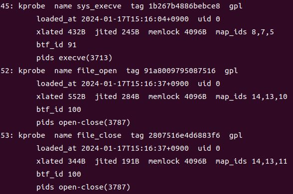

간단한 eBPF 프로그램 두가지를 작성하였다.

> 첫 번째는, Filesystem Monitor로 파일이 열리고 닫히는 것을 추적할 수 있는 프로그램이다. 파일이 열리고 닫힐 때 사용자 정보와 command 정보, 메세지를 
> 출력하게끔 작성하였다.
>
> 파일이 닫힐 때는, 모든 위치에서 닫히는 파일들을 모두 출력하여 system에서 어떤 파일이 닫히는지 확인할 수 있게 하였다.
>
> 파일이 열릴 때는, 특정 디렉토리 내에서 열리는 파일들만 출력하여 특정 디렉토리에서 어떤 파일이 열리는지 확인할 수 있게 하였다.


> 두 번째는, Process Monitor로 프로세스 추적 프로그램이다.


## Filesystem Monitor 출력 화면


## Process Monitor 출력 화면


## 두 프로그램 실행 후 확인

```
$ sudo bpftool prog list
```


