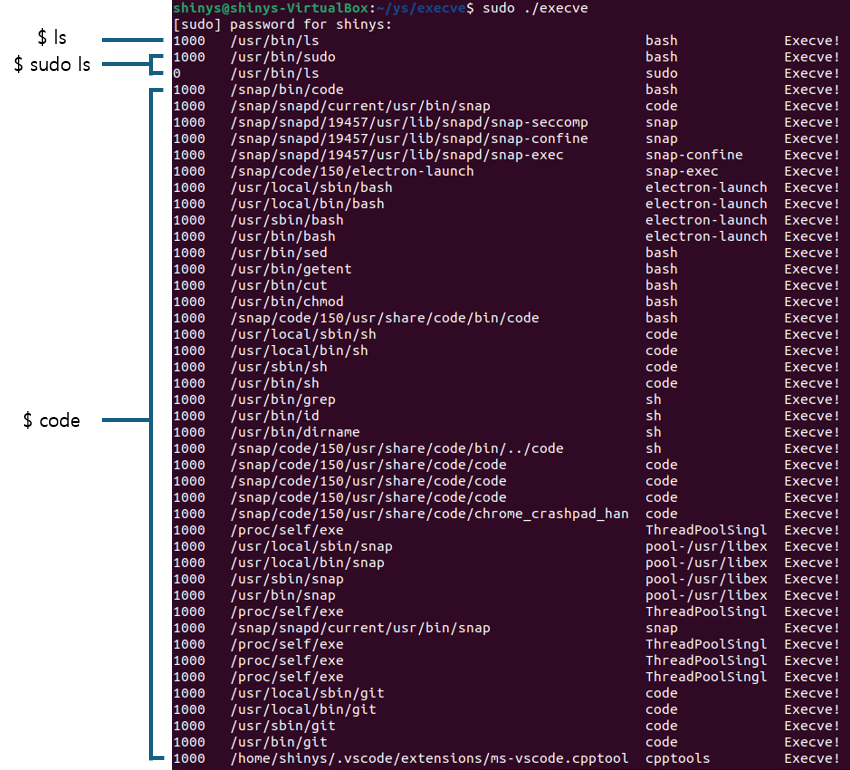

간단한 eBPF 프로그램 두가지를 작성하였다.

첫 번째는, Filesystem Monitor로 파일이 열리고 닫히는 것을 추적할 수 있는 프로그램이다. 파일이 열리고 닫힐 때 사용자 정보와


# Filesystem Monitor 출력


# Process Monitor 출력



## 두 프로그램 실행 후 확인

```
$ sudo bpftool prog list
```


